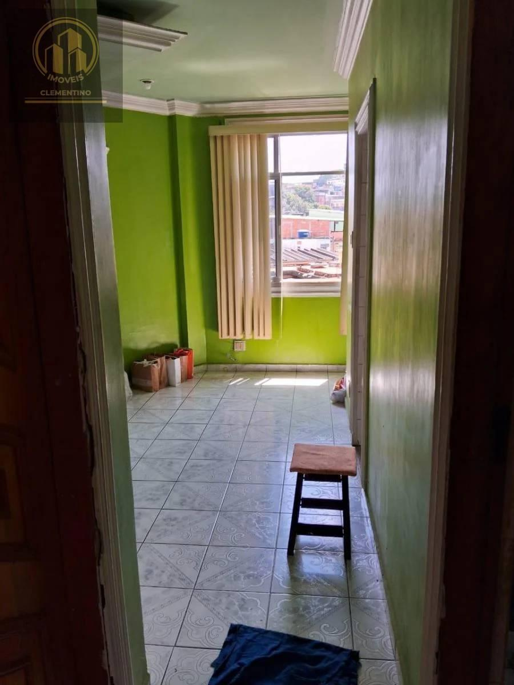
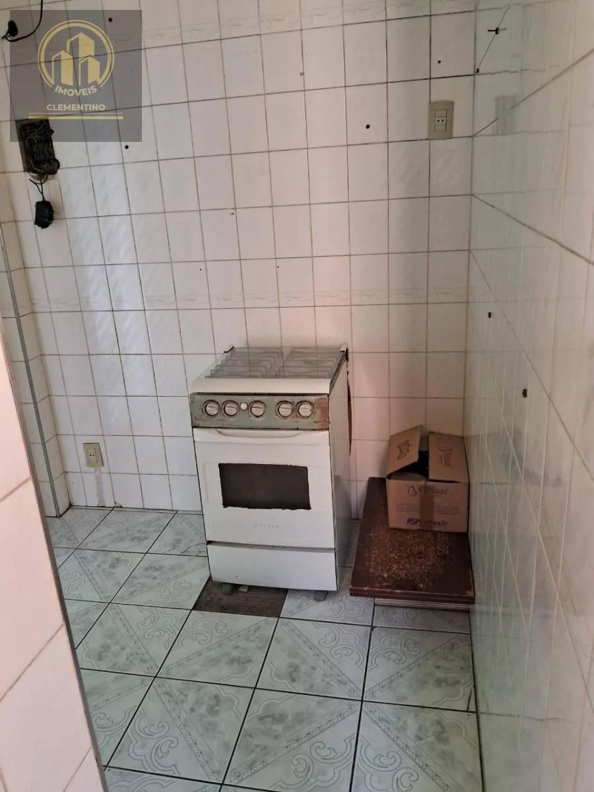
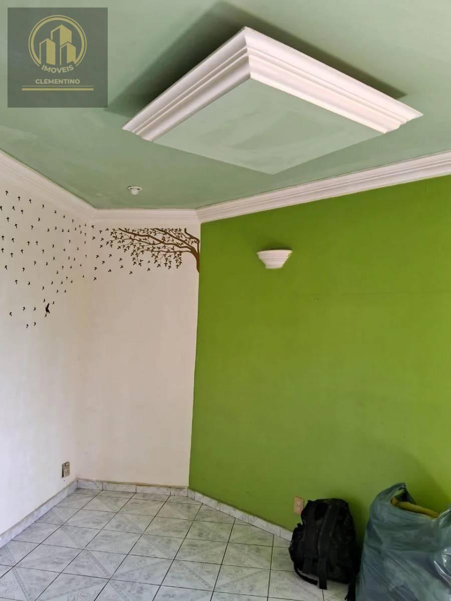
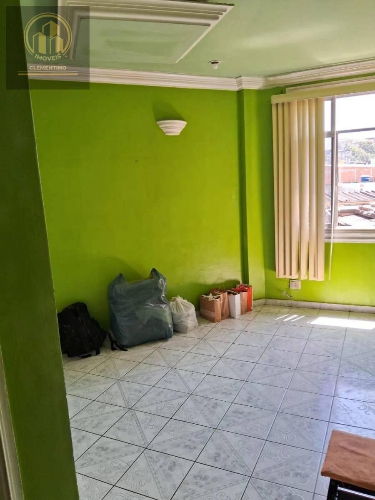

# D.Caxias, Bar Cavaleiro, Cond.Varsóvia, Carlos Sampaio, Apt 62m², 2 Qts, 3ºAndar

> **Apartamento · 62m² · 2 quartos**  
> 🔗 **Link Oficial:** [https://www.imovelweb.com.br/propriedades/d.caxias-bar-cavaleiro-cond.varsovia-carlos-3017305760.html](https://www.imovelweb.com.br/propriedades/d.caxias-bar-cavaleiro-cond.varsovia-carlos-3017305760.html)  
> 🏷️ **Código do Imóvel:** `AP0016` | **ID Imovelweb:** `3017305760`

---

## 📌 Resumo Geral

| Item | Informação |
| :--- | :--- |
| **💰 Valor de Venda / Locação** | **R$ 170.000** |
| **🏢 Condomínio** | R$ 0 |
| **📍 Endereço** | Rua Carlos Sampaio, Engenho do Porto, Duque de Caxias, RJ |
| **📅 Publicação** | 26/08/2025 (*Publicado há 358 dias*) |
| **🏢 Anunciante** | Imobiliária Clementino (CRECI: `22953`) |

---

## 📍 Localização & Coordenadas

- **Logradouro:** Rua Carlos Sampaio
- **Bairro:** Engenho do Porto
- **Cidade / UF:** Duque de Caxias - RJ
- **Coordenadas GPS:** `-22.7910034, -43.3152643`
- 🗺️ **Google Maps:** [Visualizar localização no Google Maps](https://www.google.com/maps?q=-22.7910034,-43.3152643)

---

## 🏷️ Características & Ícones em Destaque

| Ícone | Característica | Valor |
| :---: | :--- | :---: |
| 📐 | **Tot.** | `65 m²` |
| 🏠 | **Útil** | `62 m²` |
| 🚿 | **Banheiro** | `1` |
| 🛏️ | **Quarto** | `2` |
| ⏳ | **Idade do imóvel** | `40` |

---

## 📝 Descrição do Imóvel

```text
Em Duque de Caxias, junto ao Centro, a 10 minutos à pé do Calçadão de Caxias, Condomínio Habitacional Varsóvia, apto com 62 m², 3º andar, sala em 2 ambientes, banheiro social, 2 qtos, cozinha e área de serviço.
```

---

## 🏢 Contato do Anunciante / Imobiliária

- **Imobiliária:** **Imobiliária Clementino**
- **CRECI:** `22953`
- **Telefone:** `2196402`
- **WhatsApp:** [55 21964023524](https://wa.me/5521964023524)
- 🌐 **Perfil Imovelweb:** [Imobiliária Clementino](https://www.imovelweb.com.br/imobiliarias/imobiliaria-clementino_47820822-imoveis.html)

---

## 🖼️ Galeria de Fotos (10 Imagens Salvas)

Todas as fotos em alta resolução estão armazenadas na subpasta [`fotos/`](./fotos/):

| # | Arquivo Local | Título / Descrição | Tamanho |
| :---: | :--- | :--- | :---: |
| **01** | [`foto_01.jpg`](./fotos/foto_01.jpg) | Apartamento · 62m² · 2 quartos | `94.0 KB` |
| **02** | [`foto_02.jpg`](./fotos/foto_02.jpg) | Apartamento de 2 quartos, Duque de Caxias | `97.1 KB` |
| **03** | [`foto_03.jpg`](./fotos/foto_03.jpg) | Apartamento en venda de 2 quartos Engenho do Porto | `70.2 KB` |
| **04** | [`foto_04.jpg`](./fotos/foto_04.jpg) | Em Duque de Caxias, junto ao Centro, a 10 minutos à pé do Calçadão de Caxias, Co | `97.4 KB` |
| **05** | [`foto_05.jpg`](./fotos/foto_05.jpg) | Apartamento 65m² venda Engenho do Porto | `102.4 KB` |
| **06** | [`foto_06.jpg`](./fotos/foto_06.jpg) | Apartamento de 2 quartos venda R$ 170.000 | `104.0 KB` |
| **07** | [`foto_07.jpg`](./fotos/foto_07.jpg) | Apartamento · 62m² · 2 quartos - Imobiliária Clementino | `134.7 KB` |
| **08** | [`foto_08.jpg`](./fotos/foto_08.jpg) | Apartamento venda de 2 quartos | `112.0 KB` |
| **09** | [`foto_09.jpg`](./fotos/foto_09.jpg) | Apartamento · 62m² · 2 quartos | `92.0 KB` |
| **10** | [`foto_10.jpg`](./fotos/foto_10.jpg) | Apartamento de 2 quartos, Duque de Caxias | `119.4 KB` |

---

### 📷 Amostra dos Ambientes:

<div align="center">

| Foto 01 | Foto 02 |
| :---: | :---: |
|  |  |

| Foto 03 | Foto 04 |
| :---: | :---: |
|  |  |
</div>

---
*Extração realizada com sucesso via scraping automatizado em 19/08/2026 01:34:45.*
