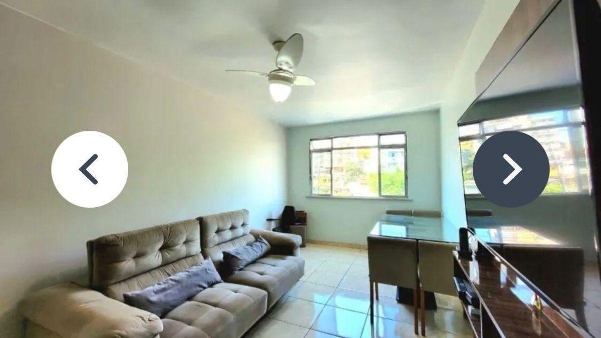
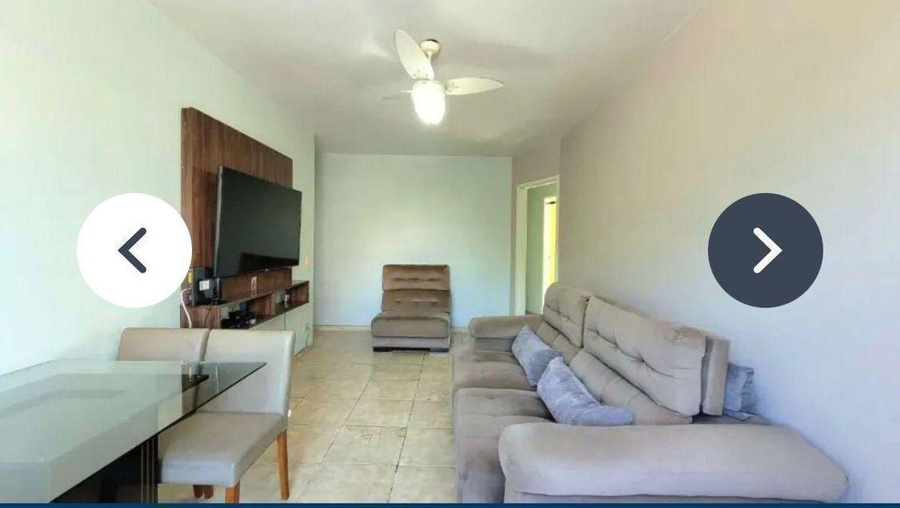
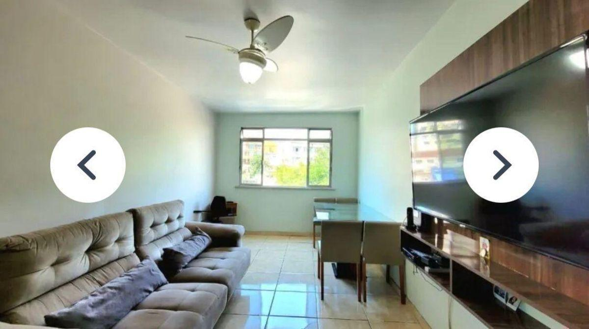
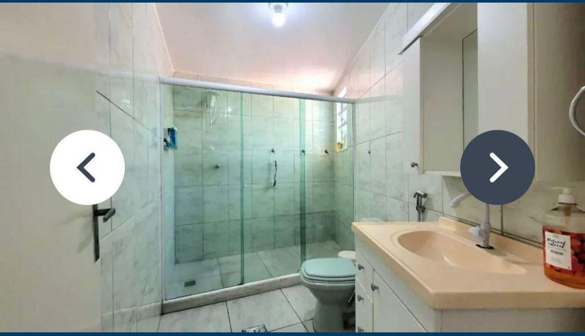

# Lgo do Bicão - Cond. Solar da Vila, Apto de 80 m², 2 Qtos (Suíte) + 1 Qto Revertido, 2Vgas Demarcada

> **Apartamento · 80m² · 2 quartos · 2 vagas**  
> 🔗 **Link Oficial:** [https://www.imovelweb.com.br/propriedades/lgo-do-bicao-cond.-solar-da-vila-apto-de-80-m-2-3028206195.html](https://www.imovelweb.com.br/propriedades/lgo-do-bicao-cond.-solar-da-vila-apto-de-80-m-2-3028206195.html)  
> 🏷️ **Código do Imóvel:** `0069` | **ID Imovelweb:** `3028206195`

---

## 📌 Resumo Geral

| Item | Informação |
| :--- | :--- |
| **💰 Valor de Venda / Locação** | **R$ 335.000** |
| **🏢 Condomínio** | R$ 475 |
| **📍 Endereço** | Rua Padre Manoel Rodrigues, 00, Vila da Penha, Rio de Janeiro, RJ |
| **📅 Publicação** | 19/02/2026 (*Publicado há 182 dias*) |
| **🏢 Anunciante** | Imobiliária Clementino (CRECI: `22953`) |

---

## 📍 Localização & Coordenadas

- **Logradouro:** Rua Padre Manoel Rodrigues, 00
- **Bairro:** Vila da Penha
- **Cidade / UF:** Rio de Janeiro - RJ
- **Coordenadas GPS:** `-22.8394441, -43.3130613`
- 🗺️ **Google Maps:** [Visualizar localização no Google Maps](https://www.google.com/maps?q=-22.8394441,-43.3130613)

---

## 🏷️ Características & Ícones em Destaque

| Ícone | Característica | Valor |
| :---: | :--- | :---: |
| 📐 | **Tot.** | `84 m²` |
| 🏠 | **Útil** | `80 m²` |
| 🚿 | **Banheiros** | `2` |
| 🚗 | **Vaga** | `2` |
| 🛏️ | **Quarto** | `2` |
| 📌 | **Suíte** | `1` |
| ⏳ | **Idade do imóvel** | `27` |

---

## 📝 Descrição do Imóvel

```text
Apartamento à venda em Vila da Penha, Largo do Bicão, Condomínio Solar da Vila, junto ao comércio, bancos e Shopping Carioca. Apto possui 80 m² de área útil. sendo composto de: sala 2 ambientes, 2 quartos, sendo 1 suíte + 1 quarto revertido, total 3 qtos, 2 banheiros, cozinha e área de serviço funcional. Possui 2 vagas de garagem, sendo 1 demarcada e outra no Condomínio.
O condomínio oferece câmeras de segurança, elevador, playground e salão de festas, além de vigilância 24h, proporcionando segurança e lazer para toda a família. Aceita FGTS e Carta de Crédito. Apartamento, em prédio com 4 andares e 30 anos de idade.
Localizado em Vila da Penha, bairro residencial com comércio diversificado e fácil acesso a serviços. Próximo a supermercados, farmácias e escolas, com diversas opções de transporte público. A região oferece um ambiente tranquilo e familiar, ideal para quem busca praticidade e bem-estar.
```

---

## 🏢 Contato do Anunciante / Imobiliária

- **Imobiliária:** **Imobiliária Clementino**
- **CRECI:** `22953`
- **Telefone:** `2196402`
- **WhatsApp:** [55 21964023524](https://wa.me/5521964023524)
- 🌐 **Perfil Imovelweb:** [Imobiliária Clementino](https://www.imovelweb.com.br/imobiliarias/imobiliaria-clementino_47820822-imoveis.html)

---

## 🖼️ Galeria de Fotos (12 Imagens Salvas)

Todas as fotos em alta resolução estão armazenadas na subpasta [`fotos/`](./fotos/):

| # | Arquivo Local | Título / Descrição | Tamanho |
| :---: | :--- | :--- | :---: |
| **01** | [`foto_01.jpg`](./fotos/foto_01.jpg) | Apartamento de 2 quartos, Rio de Janeiro | `73.7 KB` |
| **02** | [`foto_02.jpg`](./fotos/foto_02.jpg) | Apartamento en venda de 2 quartos Vila da Penha | `58.3 KB` |
| **03** | [`foto_03.jpg`](./fotos/foto_03.jpg) | Apartamento à venda em Vila da Penha, Largo do Bicão, Condomínio Solar da Vila,  | `73.8 KB` |
| **04** | [`foto_04.jpg`](./fotos/foto_04.jpg) | Apartamento venda 84m² de 2 quartos | `68.1 KB` |
| **05** | [`foto_05.jpg`](./fotos/foto_05.jpg) | Apartamento 84m² venda Vila da Penha | `67.7 KB` |
| **06** | [`foto_06.jpg`](./fotos/foto_06.jpg) | Apartamento 84m² venda Vila da Penha | `57.2 KB` |
| **07** | [`foto_07.jpg`](./fotos/foto_07.jpg) | Apartamento de 2 quartos venda R$ 335.000 | `63.0 KB` |
| **08** | [`foto_08.jpg`](./fotos/foto_08.jpg) | Apartamento · 80m² · 2 quartos · 2 vagas - Imobiliária Clementino | `66.3 KB` |
| **09** | [`foto_09.jpg`](./fotos/foto_09.jpg) | Apartamento venda de 2 quartos | `75.6 KB` |
| **10** | [`foto_10.jpg`](./fotos/foto_10.jpg) | Apartamento · 80m² · 2 quartos · 2 vagas | `70.9 KB` |
| **11** | [`foto_11.jpg`](./fotos/foto_11.jpg) | Apartamento de 2 quartos, Rio de Janeiro | `78.4 KB` |
| **12** | [`foto_12.jpg`](./fotos/foto_12.jpg) | Apartamento en venda de 2 quartos Vila da Penha | `54.9 KB` |

---

### 📷 Amostra dos Ambientes:

<div align="center">

| Foto 01 | Foto 02 |
| :---: | :---: |
|  |  |

| Foto 03 | Foto 04 |
| :---: | :---: |
|  |  |
</div>

---
*Extração realizada com sucesso via scraping automatizado em 19/08/2026 01:41:57.*
