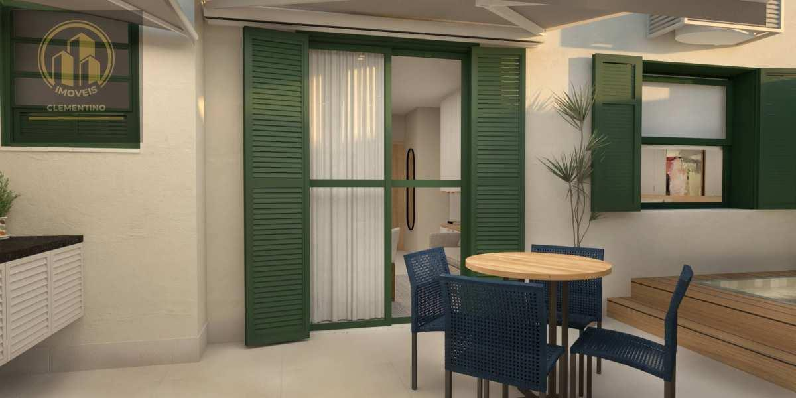
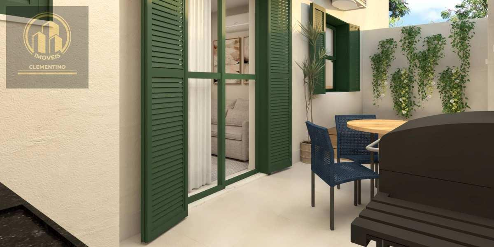
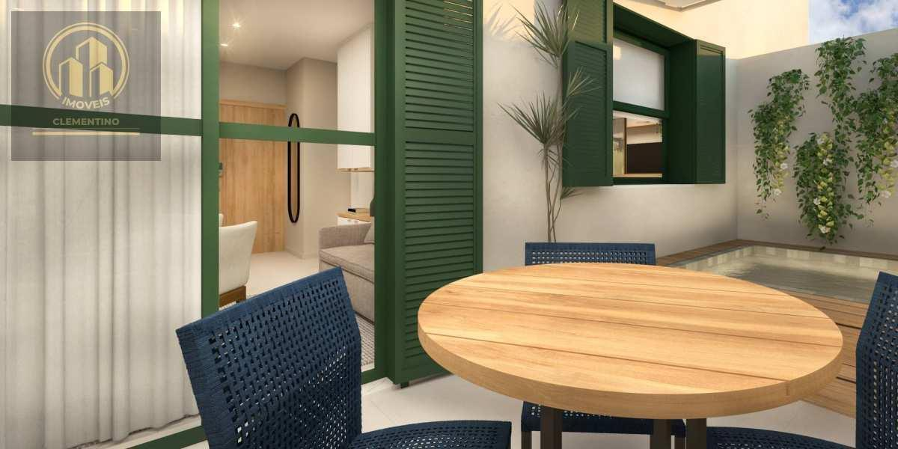
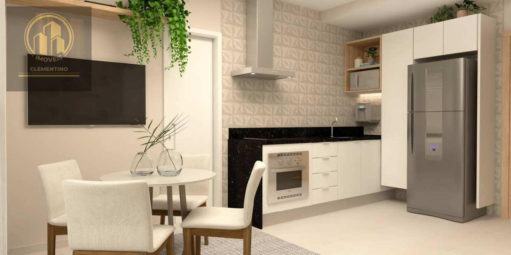

# Apartamento em Copacabana — Bairro Peixoto, garden com piscina

> **Apartamento · 58m² · 1 quarto**  
> 🔗 **Link Oficial:** [https://www.imovelweb.com.br/propriedades/r.-decio-vilares-copacabana-apto-58-04m-1-qto-1-3017305813.html](https://www.imovelweb.com.br/propriedades/r.-decio-vilares-copacabana-apto-58-04m-1-qto-1-3017305813.html)  
> 🏷️ **Código do Imóvel:** `AP0003` | **ID Imovelweb:** `3017305813`

---

## 📌 Resumo Geral

| Item | Informação |
| :--- | :--- |
| **💰 Valor de Venda / Locação** | **R$ 1.338.866** |
| **🏢 Condomínio** | R$ 805 |
| **📍 Endereço** | Rua Décio Vilares, Copacabana, Rio de Janeiro, RJ |
| **📅 Publicação** | 26/08/2025 (*Publicado há 358 dias*) |
| **🏢 Anunciante** | Imobiliária Clementino (CRECI: `22953`) |

---

## 📍 Localização & Coordenadas

- **Logradouro:** Rua Décio Vilares
- **Bairro:** Copacabana
- **Cidade / UF:** Rio de Janeiro - RJ
- **Coordenadas GPS:** `-22.9655324, -43.1908427`
- 🗺️ **Google Maps:** [Visualizar localização no Google Maps](https://www.google.com/maps?q=-22.9655324,-43.1908427)

---

## 🏷️ Características & Ícones em Destaque

| Ícone | Característica | Valor |
| :---: | :--- | :---: |
| 📐 | **Tot.** | `58 m²` |
| 🏠 | **Útil** | `58 m²` |
| 🚿 | **Banheiro** | `1` |
| 🛏️ | **Quarto** | `1` |

---

## 📝 Descrição do Imóvel

Apartamento garden de 58,04 m² no Residencial Vilares, edifício histórico revitalizado no Bairro Peixoto. A área externa possui piscina com hidromassagem e cromoterapia, toldo elétrico, deck de madeira ecológica e bancada gourmet.
A unidade conta com sala, cozinha equipada, quarto com armários e espaço de trabalho, banheiro e fechadura eletrônica. As instalações elétricas e hidráulicas são novas. O condomínio oferece coworking, lavanderia, espaço gourmet, bicicletário elétrico e elevador.

## 🏢 Contato do Anunciante / Imobiliária

- **Imobiliária:** **Imobiliária Clementino**
- **CRECI:** `22953`
- **Telefone:** `2196402`
- **WhatsApp:** [55 21964023524](https://wa.me/5521964023524)
- 🌐 **Perfil Imovelweb:** [Imobiliária Clementino](https://www.imovelweb.com.br/imobiliarias/imobiliaria-clementino_47820822-imoveis.html)

---

## 🖼️ Galeria de Fotos (25 Imagens Salvas)

Todas as fotos em alta resolução estão armazenadas na subpasta [`fotos/`](./fotos/):

| # | Arquivo Local | Título / Descrição | Tamanho |
| :---: | :--- | :--- | :---: |
| **01** | [`foto_01.jpg`](./fotos/foto_01.jpg) | Apartamento · 58m² · 1 quarto | `72.2 KB` |
| **02** | [`foto_02.jpg`](./fotos/foto_02.jpg) | Apartamento de 1 quarto, Rio de Janeiro | `81.5 KB` |
| **03** | [`foto_03.jpg`](./fotos/foto_03.jpg) | Apartamento en venda de 1 quarto Copacabana | `84.2 KB` |
| **04** | [`foto_04.jpg`](./fotos/foto_04.jpg) | Edifício histórico revitalizado no charmoso Bairro Peixoto, com apenas 19 unidad | `66.3 KB` |
| **05** | [`foto_05.jpg`](./fotos/foto_05.jpg) | Apartamento venda 58m² de 1 quarto | `64.9 KB` |
| **06** | [`foto_06.jpg`](./fotos/foto_06.jpg) | Apartamento 58m² venda Copacabana | `71.8 KB` |
| **07** | [`foto_07.jpg`](./fotos/foto_07.jpg) | Apartamento 58m² venda Copacabana | `58.4 KB` |
| **08** | [`foto_08.jpg`](./fotos/foto_08.jpg) | Apartamento de 1 quarto venda R$ 1.338.866 | `92.0 KB` |
| **09** | [`foto_09.jpg`](./fotos/foto_09.jpg) | Apartamento · 58m² · 1 quarto - Imobiliária Clementino | `73.9 KB` |
| **10** | [`foto_10.jpg`](./fotos/foto_10.jpg) | Apartamento venda de 1 quarto | `65.2 KB` |
| **11** | [`foto_11.jpg`](./fotos/foto_11.jpg) | Apartamento · 58m² · 1 quarto | `45.8 KB` |
| **12** | [`foto_12.jpg`](./fotos/foto_12.jpg) | Apartamento de 1 quarto, Rio de Janeiro | `63.3 KB` |
| **13** | [`foto_13.jpg`](./fotos/foto_13.jpg) | Apartamento en venda de 1 quarto Copacabana | `66.8 KB` |
| **14** | [`foto_14.jpg`](./fotos/foto_14.jpg) | Edifício histórico revitalizado no charmoso Bairro Peixoto, com apenas 19 unidad | `88.9 KB` |
| **15** | [`foto_15.jpg`](./fotos/foto_15.jpg) | Apartamento venda 58m² de 1 quarto | `60.1 KB` |
| **16** | [`foto_16.jpg`](./fotos/foto_16.jpg) | Apartamento 58m² venda Copacabana | `67.9 KB` |
| **17** | [`foto_17.jpg`](./fotos/foto_17.jpg) | Apartamento 58m² venda Copacabana | `74.5 KB` |
| **18** | [`foto_18.jpg`](./fotos/foto_18.jpg) | Apartamento de 1 quarto venda R$ 1.338.866 | `79.6 KB` |
| **19** | [`foto_19.jpg`](./fotos/foto_19.jpg) | Apartamento · 58m² · 1 quarto - Imobiliária Clementino | `73.8 KB` |
| **20** | [`foto_20.jpg`](./fotos/foto_20.jpg) | Apartamento venda de 1 quarto | `79.5 KB` |
| **21** | [`foto_21.jpg`](./fotos/foto_21.jpg) | Apartamento · 58m² · 1 quarto | `56.6 KB` |
| **22** | [`foto_22.jpg`](./fotos/foto_22.jpg) | Apartamento de 1 quarto, Rio de Janeiro | `87.6 KB` |
| **23** | [`foto_23.jpg`](./fotos/foto_23.jpg) | Apartamento en venda de 1 quarto Copacabana | `151.3 KB` |
| **24** | [`foto_24.jpg`](./fotos/foto_24.jpg) | Edifício histórico revitalizado no charmoso Bairro Peixoto, com apenas 19 unidad | `203.0 KB` |
| **25** | [`foto_25.jpg`](./fotos/foto_25.jpg) | Apartamento venda 58m² de 1 quarto | `165.1 KB` |

---

### 📷 Amostra dos Ambientes:

| Foto 01 | Foto 02 |
| :---: | :---: |
|  |  |

| Foto 03 | Foto 04 |
| :---: | :---: |
|  |  |

---
*Extração realizada com sucesso via scraping automatizado em 19/08/2026 01:41:14.*
