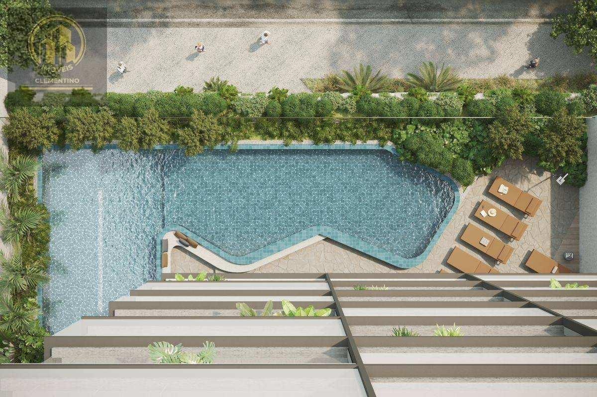
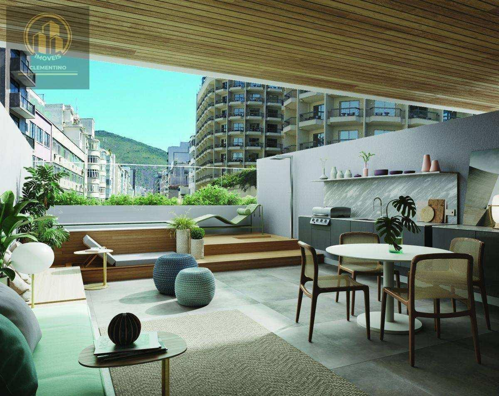

# R. Francisco Otaviano, Ipanema - Apto De Luxo 39m², 1 Qto, 1 Suíte, 1 WC, 1 Vaga Garagem

> **Apartamento · 39m² · 1 quarto · 1 vaga**  
> 🔗 **Link Oficial:** [https://www.imovelweb.com.br/propriedades/r.-francisco-otaviano-ipanema-apto-de-luxo-39m-1-3017305790.html](https://www.imovelweb.com.br/propriedades/r.-francisco-otaviano-ipanema-apto-de-luxo-39m-1-3017305790.html)  
> 🏷️ **Código do Imóvel:** `AP0004` | **ID Imovelweb:** `3017305790`

---

## 📌 Resumo Geral

| Item | Informação |
| :--- | :--- |
| **💰 Valor de Venda / Locação** | **R$ 1.950.000** |
| **🏢 Condomínio** | R$ 1000 |
| **📍 Endereço** | Rua Francisco Otaviano, Copacabana, Rio de Janeiro, RJ |
| **📅 Publicação** | 26/08/2025 (*Publicado há 358 dias*) |
| **🏢 Anunciante** | Imobiliária Clementino (CRECI: `22953`) |

---

## 📍 Localização & Coordenadas

- **Logradouro:** Rua Francisco Otaviano
- **Bairro:** Copacabana
- **Cidade / UF:** Rio de Janeiro - RJ
- **Coordenadas GPS:** `-22.9871380, -43.1916079`
- 🗺️ **Google Maps:** [Visualizar localização no Google Maps](https://www.google.com/maps?q=-22.9871380,-43.1916079)

---

## 🏷️ Características & Ícones em Destaque

| Ícone | Característica | Valor |
| :---: | :--- | :---: |
| 📐 | **Tot.** | `39 m²` |
| 🏠 | **Útil** | `39 m²` |
| 🚿 | **Banheiro** | `1` |
| 🚗 | **Vaga** | `1` |
| 🛏️ | **Quarto** | `1` |
| 📌 | **Suíte** | `1` |
| ⏳ | **Idade do imóvel** | `2` |

---

## 📝 Descrição do Imóvel

```text
Localizado no coração do Arpoador, o Canto Rio não é apenas um endereço, mas uma experiência. Com mais de 2.000m² de área de lazer e serviços exclusivos, este empreendimento já está 100% vendido, sendo essa unidade uma oportunidade rara no mercado.
Studio de 38,08m², com varanda e área gourmet, VISTA MAR e experiências inéditas em mais de 2.000m² de área de lazer e serviços na zona sul do Rio de Janeiro;
Piscina de 25m com raias, sauna, bar, academia by Companhia Atlética, sala de massagem, sauna, bar, lounge, lavanderia e muito mais. O Canto Rio também se destaca por seus diferenciais tecnológicos, incluindo fechadura smart lock e infraestrutura para comando de voz IOT.
Segurança única, com: Sistema de reconhecimento facial para controle de acesso dos moradores com integrac?a?o a? portaria remota; Seguranc?a perimetral monitorada; Circuito de CFTV com acesso remoto; Controle eletro?nico de acesso de vei?culos; Acesso separado de entregas/servic?os;
Localizado entre o mar e o que o Rio tem de melhor, a alguns passos de tudo que o Arpoador tem a oferecer.
01 vaga na escritura.
Não perca esta chance única! Entre em contato e agende sua visita.
```

---

## 🏢 Contato do Anunciante / Imobiliária

- **Imobiliária:** **Imobiliária Clementino**
- **CRECI:** `22953`
- **Telefone:** `2196402`
- **WhatsApp:** [55 21964023524](https://wa.me/5521964023524)
- 🌐 **Perfil Imovelweb:** [Imobiliária Clementino](https://www.imovelweb.com.br/imobiliarias/imobiliaria-clementino_47820822-imoveis.html)

---

## 🖼️ Galeria de Fotos (28 Imagens Salvas)

Todas as fotos em alta resolução estão armazenadas na subpasta [`fotos/`](./fotos/):

| # | Arquivo Local | Título / Descrição | Tamanho |
| :---: | :--- | :--- | :---: |
| **01** | [`foto_01.jpg`](./fotos/foto_01.jpg) | Apartamento · 39m² · 1 quarto · 1 vaga | `100.0 KB` |
| **02** | [`foto_02.jpg`](./fotos/foto_02.jpg) | Apartamento de 1 quarto, Rio de Janeiro | `125.2 KB` |
| **03** | [`foto_03.jpg`](./fotos/foto_03.jpg) | Apartamento en venda de 1 quarto Copacabana | `259.9 KB` |
| **04** | [`foto_04.jpg`](./fotos/foto_04.jpg) | Localizado no coração do Arpoador, o Canto Rio não é apenas um endereço, mas uma | `249.8 KB` |
| **05** | [`foto_05.jpg`](./fotos/foto_05.jpg) | Apartamento venda 39m² de 1 quarto | `89.2 KB` |
| **06** | [`foto_06.jpg`](./fotos/foto_06.jpg) | Apartamento 39m² venda Copacabana | `155.0 KB` |
| **07** | [`foto_07.jpg`](./fotos/foto_07.jpg) | Apartamento 39m² venda Copacabana | `133.9 KB` |
| **08** | [`foto_08.jpg`](./fotos/foto_08.jpg) | Apartamento de 1 quarto venda R$ 1.950.000 | `136.9 KB` |
| **09** | [`foto_09.jpg`](./fotos/foto_09.jpg) | Apartamento · 39m² · 1 quarto · 1 vaga - Imobiliária Clementino | `126.7 KB` |
| **10** | [`foto_10.jpg`](./fotos/foto_10.jpg) | Apartamento venda de 1 quarto | `108.1 KB` |
| **11** | [`foto_11.jpg`](./fotos/foto_11.jpg) | Apartamento · 39m² · 1 quarto · 1 vaga | `136.3 KB` |
| **12** | [`foto_12.jpg`](./fotos/foto_12.jpg) | Apartamento de 1 quarto, Rio de Janeiro | `127.0 KB` |
| **13** | [`foto_13.jpg`](./fotos/foto_13.jpg) | Apartamento en venda de 1 quarto Copacabana | `119.2 KB` |
| **14** | [`foto_14.jpg`](./fotos/foto_14.jpg) | Localizado no coração do Arpoador, o Canto Rio não é apenas um endereço, mas uma | `70.0 KB` |
| **15** | [`foto_15.jpg`](./fotos/foto_15.jpg) | Apartamento venda 39m² de 1 quarto | `89.1 KB` |
| **16** | [`foto_16.jpg`](./fotos/foto_16.jpg) | Apartamento 39m² venda Copacabana | `100.0 KB` |
| **17** | [`foto_17.jpg`](./fotos/foto_17.jpg) | Apartamento 39m² venda Copacabana | `61.5 KB` |
| **18** | [`foto_18.jpg`](./fotos/foto_18.jpg) | Apartamento de 1 quarto venda R$ 1.950.000 | `52.0 KB` |
| **19** | [`foto_19.jpg`](./fotos/foto_19.jpg) | Apartamento · 39m² · 1 quarto · 1 vaga - Imobiliária Clementino | `90.6 KB` |
| **20** | [`foto_20.jpg`](./fotos/foto_20.jpg) | Apartamento venda de 1 quarto | `539.7 KB` |
| **21** | [`foto_21.jpg`](./fotos/foto_21.jpg) | Apartamento · 39m² · 1 quarto · 1 vaga | `286.2 KB` |
| **22** | [`foto_22.jpg`](./fotos/foto_22.jpg) | Apartamento de 1 quarto, Rio de Janeiro | `225.0 KB` |
| **23** | [`foto_23.jpg`](./fotos/foto_23.jpg) | Apartamento en venda de 1 quarto Copacabana | `183.6 KB` |
| **24** | [`foto_24.jpg`](./fotos/foto_24.jpg) | Localizado no coração do Arpoador, o Canto Rio não é apenas um endereço, mas uma | `180.2 KB` |
| **25** | [`foto_25.jpg`](./fotos/foto_25.jpg) | Apartamento venda 39m² de 1 quarto | `60.6 KB` |
| **26** | [`foto_26.jpg`](./fotos/foto_26.jpg) | Apartamento 39m² venda Copacabana | `74.3 KB` |
| **27** | [`foto_27.jpg`](./fotos/foto_27.jpg) | Apartamento 39m² venda Copacabana | `38.3 KB` |
| **28** | [`foto_28.jpg`](./fotos/foto_28.jpg) | Apartamento de 1 quarto venda R$ 1.950.000 | `50.2 KB` |

---

### 📷 Amostra dos Ambientes:

<div align="center">

| Foto 01 | Foto 02 |
| :---: | :---: |
|  |  |

| Foto 03 | Foto 04 |
| :---: | :---: |
|  |  |
</div>

---
*Extração realizada com sucesso via scraping automatizado em 19/08/2026 01:35:16.*
