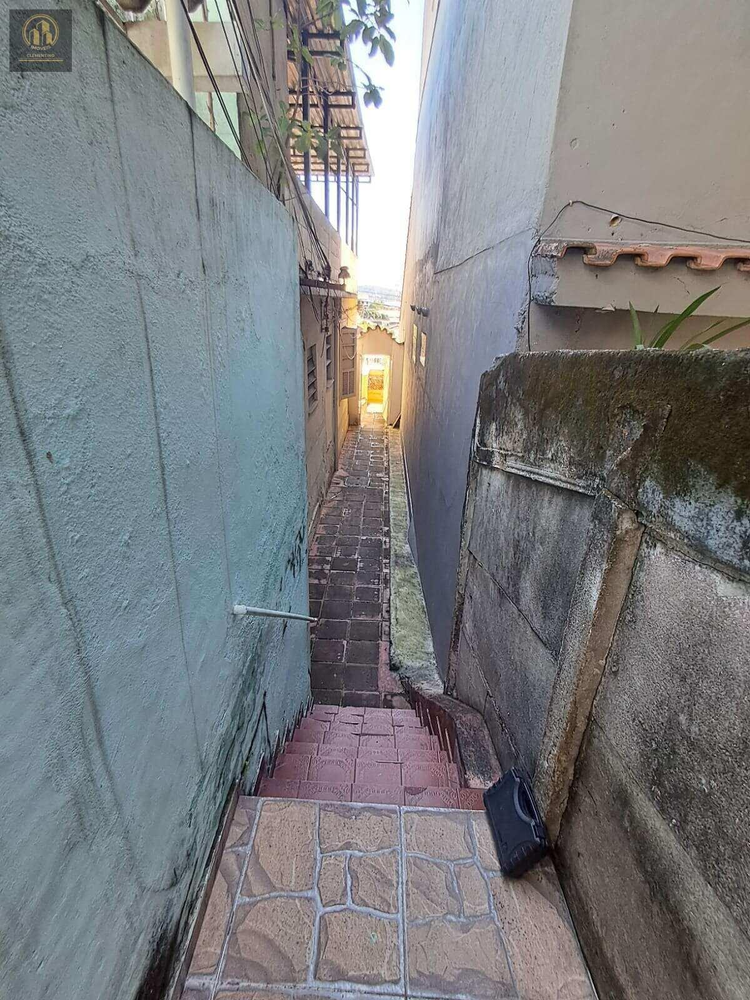
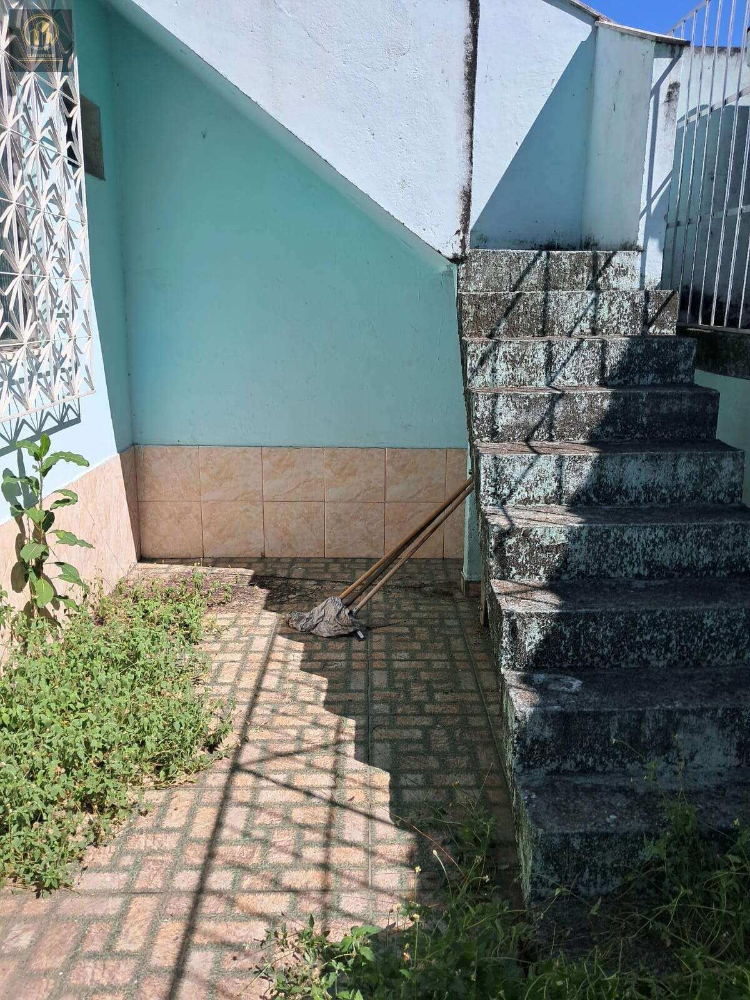
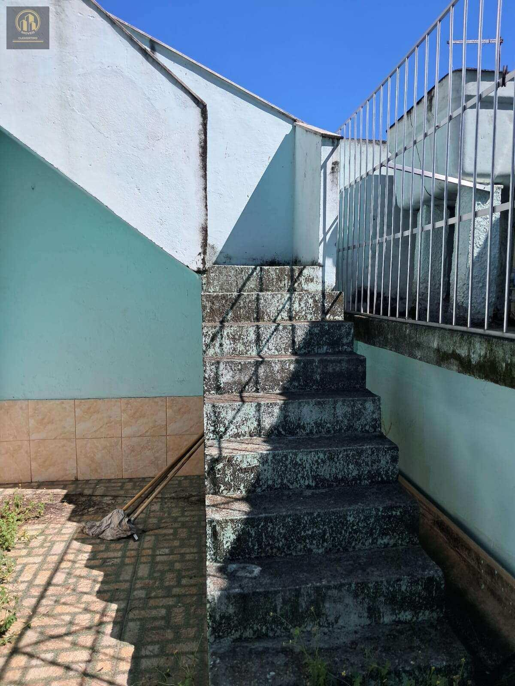
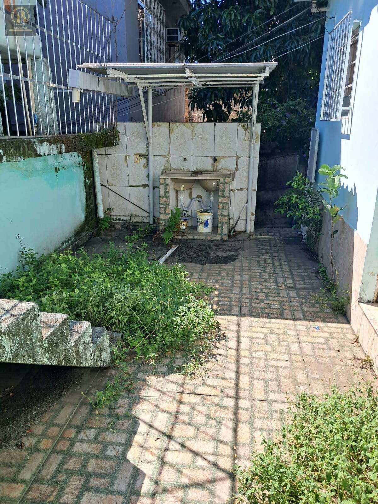

# Casa em Vigário Geral — Rua São Bartolomeu, fundos e terraço

> **Apartamento · 55m² · 1 quarto**  
> 🔗 **Link Oficial:** [https://www.imovelweb.com.br/propriedades/v.-geral-r.-sao-bartolomeu-casa-de-fdos-55-m-3017305764.html](https://www.imovelweb.com.br/propriedades/v.-geral-r.-sao-bartolomeu-casa-de-fdos-55-m-3017305764.html)  
> 🏷️ **Código do Imóvel:** `AP0039` | **ID Imovelweb:** `3017305764`

---

## 📌 Resumo Geral

| Item | Informação |
| :--- | :--- |
| **💰 Valor de Venda / Locação** | **R$ 130.000** |
| **🏢 Condomínio** | R$ 0 |
| **📍 Endereço** | Rua São Bartolomeu, Vigário Geral, Rio de Janeiro, RJ |
| **📅 Publicação** | 26/08/2025 (*Publicado há 358 dias*) |
| **🏢 Anunciante** | Imobiliária Clementino (CRECI: `22953`) |

---

## 📍 Localização & Coordenadas

- **Logradouro:** Rua São Bartolomeu
- **Bairro:** Vigário Geral
- **Cidade / UF:** Rio de Janeiro - RJ
- **Coordenadas GPS:** `-22.8107659, -43.3059627`
- 🗺️ **Google Maps:** [Visualizar localização no Google Maps](https://www.google.com/maps?q=-22.8107659,-43.3059627)

---

## 🏷️ Características & Ícones em Destaque

| Ícone | Característica | Valor |
| :---: | :--- | :---: |
| 📐 | **Tot.** | `55 m²` |
| 🏠 | **Útil** | `55 m²` |
| 🚿 | **Banheiro** | `1` |
| 🛏️ | **Quarto** | `1` |
| ⏳ | **Idade do imóvel** | `35` |

---

## 📝 Descrição do Imóvel

Casa de fundos com 55 m², situada em terreno compartilhado com outras duas residências na Rua São Bartolomeu. Possui sala, um quarto amplo, cozinha, banheiro, área frontal, terraço coberto, quintal e cisterna.
O imóvel está desocupado, com pintura nova, água e energia elétrica individualizadas e isenção de IPTU. A documentação está regular e permite financiamento bancário.

## 🏢 Contato do Anunciante / Imobiliária

- **Imobiliária:** **Imobiliária Clementino**
- **CRECI:** `22953`
- **Telefone:** `(21) 96`
- **WhatsApp:** [55 21964023524](https://wa.me/5521964023524)
- 🌐 **Perfil Imovelweb:** [Imobiliária Clementino](https://www.imovelweb.com.br/imobiliarias/imobiliaria-clementino_47820822-imoveis.html)

---

## 🖼️ Galeria de Fotos (11 Imagens Salvas)

Todas as fotos em alta resolução estão armazenadas na subpasta [`fotos/`](./fotos/):

| # | Arquivo Local | Título / Descrição | Tamanho |
| :---: | :--- | :--- | :---: |
| **01** | [`foto_01.jpg`](./fotos/foto_01.jpg) | Apartamento · 55m² · 1 quarto | `332.8 KB` |
| **02** | [`foto_02.jpg`](./fotos/foto_02.jpg) | Apartamento de 1 quarto, Rio de Janeiro | `380.4 KB` |
| **03** | [`foto_03.jpg`](./fotos/foto_03.jpg) | Apartamento en venda de 1 quarto Vigário Geral | `286.2 KB` |
| **04** | [`foto_04.jpg`](./fotos/foto_04.jpg) | Vigário Geral - Rua São Bartolomeu, casa de fundos com 55 m², em terreno com mai | `431.0 KB` |
| **05** | [`foto_05.jpg`](./fotos/foto_05.jpg) | Apartamento venda 55m² de 1 quarto | `342.4 KB` |
| **06** | [`foto_06.jpg`](./fotos/foto_06.jpg) | Apartamento 55m² venda Vigário Geral | `185.6 KB` |
| **07** | [`foto_07.jpg`](./fotos/foto_07.jpg) | Apartamento 55m² venda Vigário Geral | `102.6 KB` |
| **08** | [`foto_08.jpg`](./fotos/foto_08.jpg) | Apartamento de 1 quarto venda R$ 130.000 | `177.3 KB` |
| **09** | [`foto_09.jpg`](./fotos/foto_09.jpg) | Apartamento · 55m² · 1 quarto - Imobiliária Clementino | `157.6 KB` |
| **10** | [`foto_10.jpg`](./fotos/foto_10.jpg) | Apartamento venda de 1 quarto | `189.0 KB` |
| **11** | [`foto_11.jpg`](./fotos/foto_11.jpg) | Apartamento · 55m² · 1 quarto | `214.4 KB` |

---

### 📷 Amostra dos Ambientes:

| Foto 01 | Foto 02 |
| :---: | :---: |
|  |  |

| Foto 03 | Foto 04 |
| :---: | :---: |
|  |  |

---
*Extração realizada com sucesso via scraping automatizado em 19/08/2026 01:34:47.*
