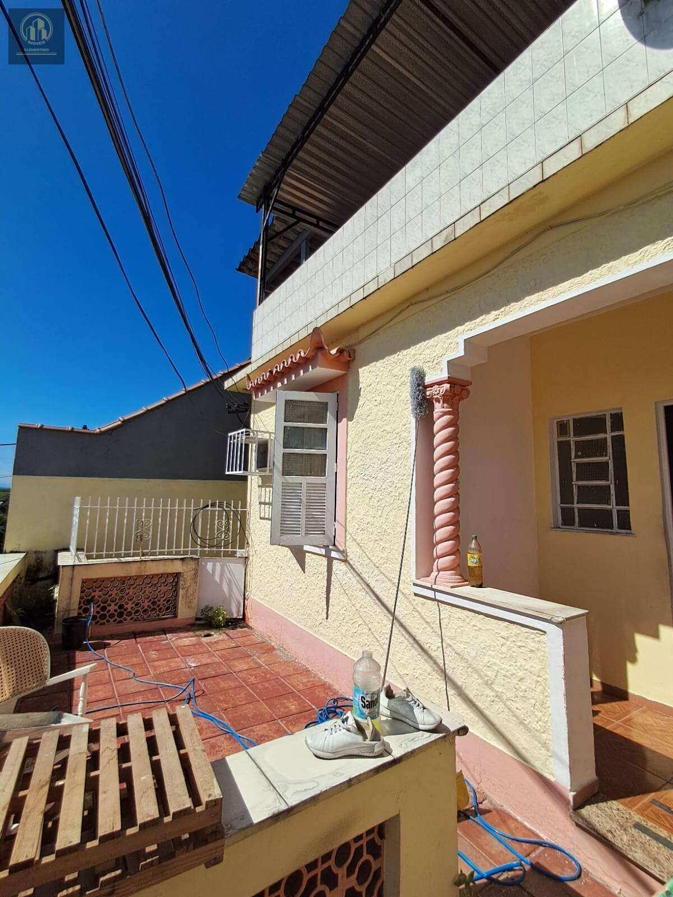
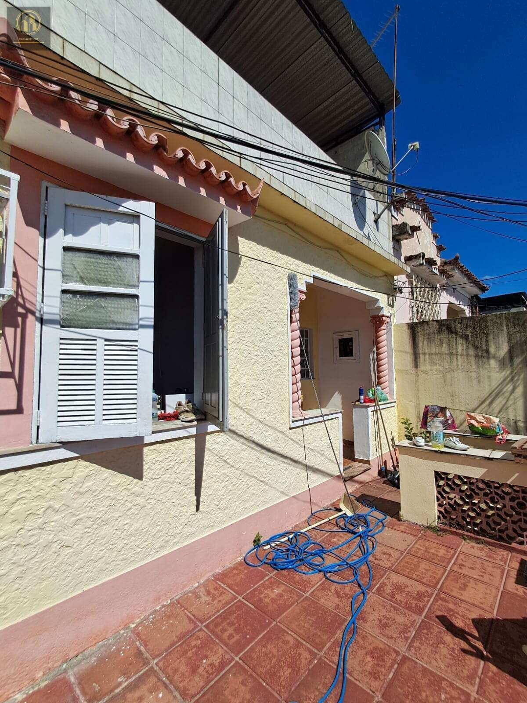
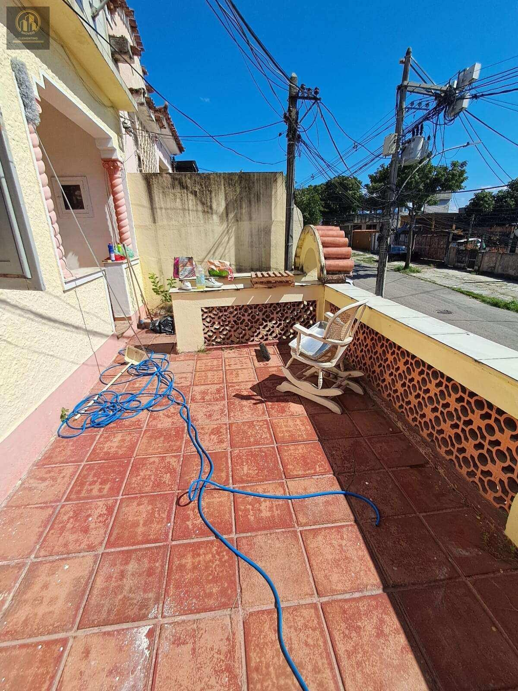
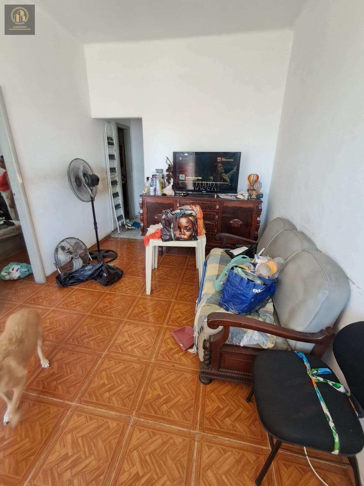

# Casa em Vigário Geral — Rua São Bartolomeu, independente e com terraço

> **Casa · 169m² · 2 quartos**  
> 🔗 **Link Oficial:** [https://www.imovelweb.com.br/propriedades/v.-geral-r.-sao-bartolomeu-casa-de-frente-169-m-3017305787.html](https://www.imovelweb.com.br/propriedades/v.-geral-r.-sao-bartolomeu-casa-de-frente-169-m-3017305787.html)  
> 🏷️ **Código do Imóvel:** `CA0019` | **ID Imovelweb:** `3017305787`

---

## 📌 Resumo Geral

| Item | Informação |
| :--- | :--- |
| **💰 Valor de Venda / Locação** | **R$ 239.000** |
| **🏢 Condomínio** | R$ 0 |
| **📍 Endereço** | Rua São Bartolomeu, Vigário Geral, Rio de Janeiro, RJ |
| **📅 Publicação** | 26/08/2025 (*Publicado há 358 dias*) |
| **🏢 Anunciante** | Imobiliária Clementino (CRECI: `22953`) |

---

## 📍 Localização & Coordenadas

- **Logradouro:** Rua São Bartolomeu
- **Bairro:** Vigário Geral
- **Cidade / UF:** Rio de Janeiro - RJ
- **Coordenadas GPS:** `-22.8107659, -43.3059627`
- 🗺️ **Google Maps:** [Visualizar localização no Google Maps](https://www.google.com/maps?q=-22.8107659,-43.3059627)

---

## 🏷️ Características & Ícones em Destaque

| Ícone | Característica | Valor |
| :---: | :--- | :---: |
| 📐 | **Tot.** | `170 m²` |
| 🏠 | **Útil** | `169 m²` |
| 🚿 | **Banheiros** | `2` |
| 🛏️ | **Quarto** | `2` |

---

## 📝 Descrição do Imóvel

Casa de frente para a rua, com entrada independente e 169 m². O primeiro pavimento possui quintal, varanda, sala em dois ambientes, dois quartos, banheiro social, copa-cozinha, varanda nos fundos, lavanderia e quarto de serviço.
No pavimento superior, há terraço coberto, copa e banheiro. A água e a energia elétrica são individualizadas, a documentação está regular e o imóvel aceita carta de crédito.

## 🏢 Contato do Anunciante / Imobiliária

- **Imobiliária:** **Imobiliária Clementino**
- **CRECI:** `22953`
- **Telefone:** `(21) 96`
- **WhatsApp:** [55 21964023524](https://wa.me/5521964023524)
- 🌐 **Perfil Imovelweb:** [Imobiliária Clementino](https://www.imovelweb.com.br/imobiliarias/imobiliaria-clementino_47820822-imoveis.html)

---

## 🖼️ Galeria de Fotos (16 Imagens Salvas)

Todas as fotos em alta resolução estão armazenadas na subpasta [`fotos/`](./fotos/):

| # | Arquivo Local | Título / Descrição | Tamanho |
| :---: | :--- | :--- | :---: |
| **01** | [`foto_01.jpg`](./fotos/foto_01.jpg) | Casa · 169m² · 2 quartos | `265.6 KB` |
| **02** | [`foto_02.jpg`](./fotos/foto_02.jpg) | Casa de 2 quartos, Rio de Janeiro | `327.0 KB` |
| **03** | [`foto_03.jpg`](./fotos/foto_03.jpg) | Casa en venda de 2 quartos Vigário Geral | `382.7 KB` |
| **04** | [`foto_04.jpg`](./fotos/foto_04.jpg) | Casa frente de rua com 169 m², independente, em terreno de 840m² com mais duas c | `175.6 KB` |
| **05** | [`foto_05.jpg`](./fotos/foto_05.jpg) | Casa venda 170m² de 2 quartos | `136.1 KB` |
| **06** | [`foto_06.jpg`](./fotos/foto_06.jpg) | Casa 170m² venda Vigário Geral | `185.5 KB` |
| **07** | [`foto_07.jpg`](./fotos/foto_07.jpg) | Casa 170m² venda Vigário Geral | `154.8 KB` |
| **08** | [`foto_08.jpg`](./fotos/foto_08.jpg) | Casa de 2 quartos venda R$ 239.000 | `201.2 KB` |
| **09** | [`foto_09.jpg`](./fotos/foto_09.jpg) | Casa · 169m² · 2 quartos - Imobiliária Clementino | `171.4 KB` |
| **10** | [`foto_10.jpg`](./fotos/foto_10.jpg) | Casa venda de 2 quartos | `173.7 KB` |
| **11** | [`foto_11.jpg`](./fotos/foto_11.jpg) | Casa · 169m² · 2 quartos | `214.8 KB` |
| **12** | [`foto_12.jpg`](./fotos/foto_12.jpg) | Casa de 2 quartos, Rio de Janeiro | `178.4 KB` |
| **13** | [`foto_13.jpg`](./fotos/foto_13.jpg) | Casa en venda de 2 quartos Vigário Geral | `312.0 KB` |
| **14** | [`foto_14.jpg`](./fotos/foto_14.jpg) | Casa frente de rua com 169 m², independente, em terreno de 840m² com mais duas c | `195.1 KB` |
| **15** | [`foto_15.jpg`](./fotos/foto_15.jpg) | Casa venda 170m² de 2 quartos | `142.7 KB` |
| **16** | [`foto_16.jpg`](./fotos/foto_16.jpg) | Casa 170m² venda Vigário Geral | `210.6 KB` |

---

### 📷 Amostra dos Ambientes:

| Foto 01 | Foto 02 |
| :---: | :---: |
|  |  |

| Foto 03 | Foto 04 |
| :---: | :---: |
|  |  |

---
*Extração realizada com sucesso via scraping automatizado em 19/08/2026 01:35:10.*
